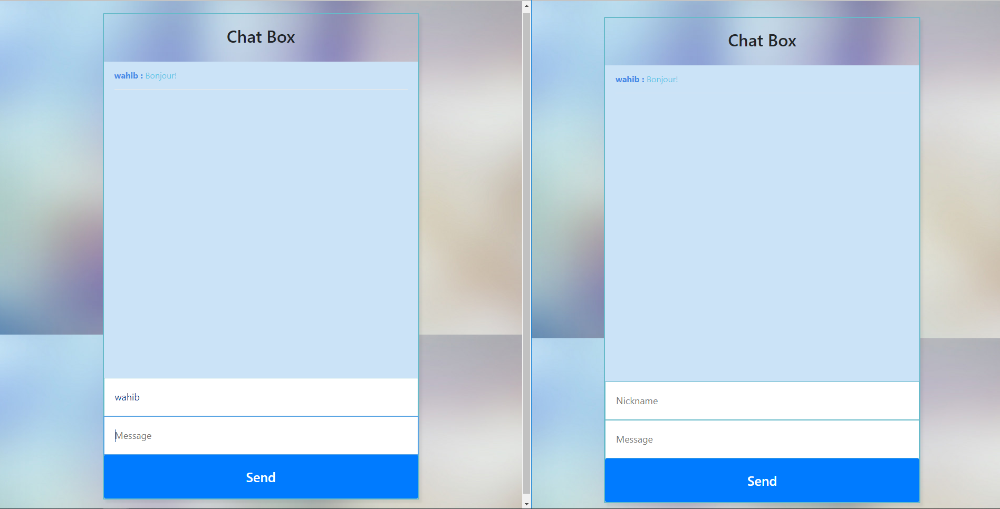
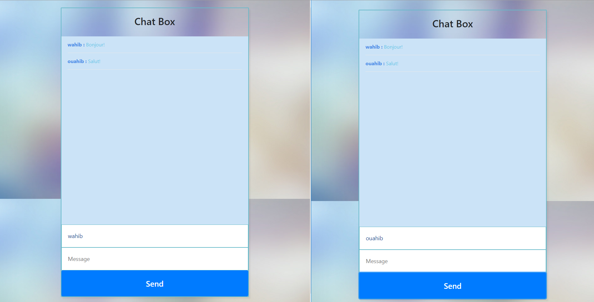
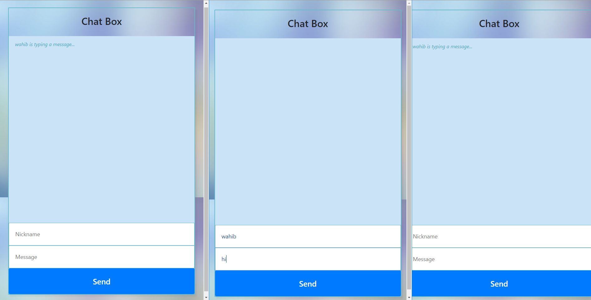

# Real time chat app
simple real time chat app, socket.io, vanilla JS, bootstrap4, node, express

## review

## sending a message from user A to user B (after setting up nicknames) will appear in both UI's

